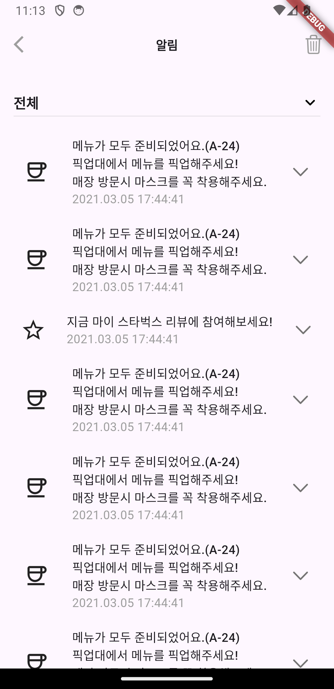
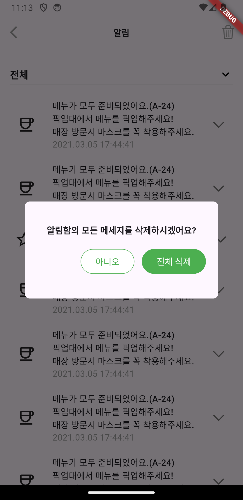

## 스타벅스 알림 화면 구현

### 내맘대로 생각하는 UI 구조
* AppBar
    * Leading - 백버튼
    * CenterTitle - True
    * Title
    * Actions
        * IconButton(알림 삭제)
* Column
    * Padding 
      * DropdownMenu
    * Expanded
      * ListView.builder
* Dialog

### 알게된 것들
* extension on 이 다른 파일에 있을 경우, 이를 import 하더라도 사용할 수 없다. 사용하고자 하는 파일 내에서 작성해 사용해야한다.

* spred operator
  * 개념
    * 리스트나 컬렉션 안에서 다른 리스트나 컬렉션을 펼쳐서 삽입해주는 역할을 한다.
  * 예제
    ```dart
    if (isExpanded) ...{
        Container(
            height: 75,
            color: const Color.fromARGB(255, 239, 236, 236),
            width: MediaQuery.sizeOf(context).width,
            child: NotificationSubItem(
                notiIcon: NotificationIconType.coffee,
                body: '8번째 메뉴로 준비중입니다. (A-32)',
                date: '2021.02.25 13:59:33',
            ),
        ),
        const SizedBox(
            height: 20,
        ),
    }
    ```
    * isExpanded 라는 조건이 성립할 경우 {  } 구문내에 있는 List<Widget> 들을 펼쳐서 화면에 보여줄 수 있게 된다. 여기서는 Container와 sizedBox가 해당 된다.
  
### 구현 화면

