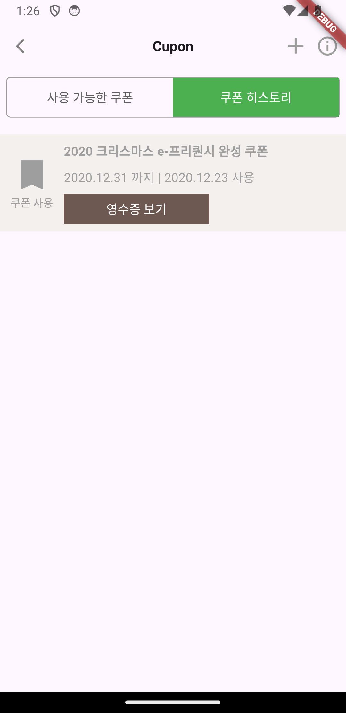
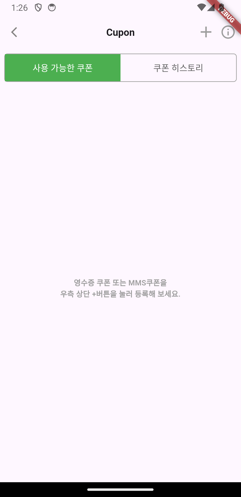

## 스타벅스 쿠폰 화면 구현

### 내맘대로 생각하는 UI 구조
* 쿠폰 리스트 화면
  * DefaultTabController
    * AppBar
      * Leading - 백버튼
      * CenterTitle - True
      * Title
      * Actions
          * IconButton(등록), IconButton(정보)
    * Column
      * Container
        * Tabbar - Tab
      * Expanded
        * TabBarView
        * ...
  
* 쿠폰 등록 화면
  * Scaffold
    * AppBar - 위와 동일 ( 아이콘 버튼 하나만 제거 )
  * Column
    * Text
    * Row
      * CheckBox - Text
    * Text
    * Row
      * TextField - Container(border)
    * Text
      * TextField
    * Button
    * Expanded
      * Column
        * Text
        * Button

### 알게된 것들
* AppBar에서 trailing 위치에 오는 버튼들을 title과 Row로 묶지 말고, actions에 추가해 사용하면 된다.

* TabView를 구현하기 위해서는 DefaultTabController를 상위 위젯으로 가지고 있어야하고 탭의 갯수를 지정해줘야한다. 또한, tabController를 TabBar와 TabBarView가 공유하고 있어야한다.
  ```dart
  late TabController _tabController;

  DefaultTabController(
    lenth: 2, // 필수!
    child: // ...
    body: Column(
      // ...
      TabBar(
        controller: _tabController,
        // ...
      ),
    ),
    Expanded(
      child: Container(
        child: TaBarView(
          controller: _tabController,
          // ...
        ),
      ),
    ),
  )
  ```

* TextField에서 기본 Border를 만들고 싶을 때는 Border, EnableBorder 모두를 동일한 값을 사용해야된다는 블로그 게시물을 봤는데 EnableBorder만 변경하면 된다.
  
### 구현 화면


