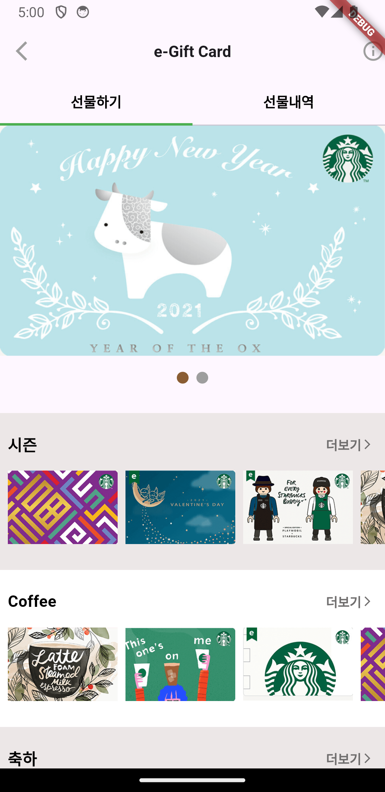

## 스타벅스 선물 화면 구현

### 내맘대로 생각하는 UI 구조
* DefaultTabController
  * AppBar
      * Leading - 백버튼
      * CenterTitle - True
      * Title
      * Actions
          * IconButton(정보)
  * Body
      * ListView
        * Tabbar - Tab
        * Column
          * PageView
          * ImageScrollView - Custom / 3개
            * Title
            * IconButton
            * Scrollable Row

### 알게된 것들
* Flutter에는 기본적으로 PageView라는 위젯이 있다. 다만, Indicator는 커스텀해서 사용해야함.
    ```dart
    PageView(
        controller: _pageController,
        scrollDirection: Axis.horizontal,
        onPageChanged: ((int page) {
            setState(() {
            _currentPage = page; // Indicator 변경을 위해
            });
        }),
        children: [
            Image.asset(
                'images/starbucks/card_big.png',
                fit: BoxFit.fill,
            ),
            Image.asset(
                'images/starbucks/card_big.png',
                fit: BoxFit.fill,
            ),
        ],
    ),
    Padding(
        padding: const EdgeInsets.only(top: 16, bottom: 30),
        child: Row(
            mainAxisAlignment: MainAxisAlignment.center,
            children: List.generate(
                2, (index) => _buildIndicator(index),
            ),
        ),
    ),

    // ...

    Widget _buildIndicator(int index) {
        return Container(
            margin: const EdgeInsets.symmetric(horizontal: 4.0),
            width: 12,
            height: 12,
            decoration: BoxDecoration(
                shape: BoxShape.circle,
                color: _currentPage == index
                    ? const Color.fromARGB(255, 138, 93, 51)
                    : Colors.grey,
            ),
        );
    }
    ```
  * Column과 Row는 갯수가 정해져있을 경우, 정해져있지 않으면 ListView, ScrollChildScrollView 등을 사용하기.
  
### 구현 화면
