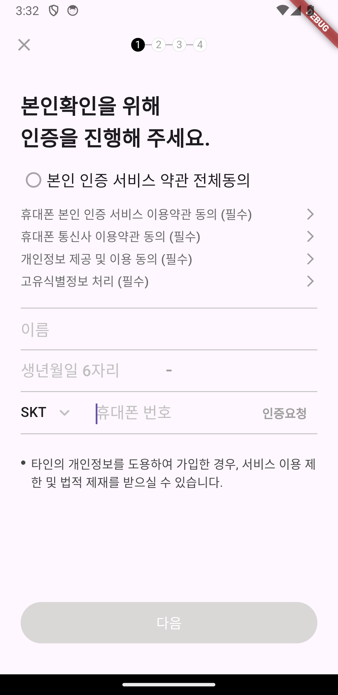

## 스타벅스 회원가입 화면(1)
* 본인확인 화면

### 내맘대로 생각하는 UI 구조
* AppBar - X 버튼, 상단 아이콘
* Center - 전체 컨텐츠
  * Column - Alignment.start
    * Text - 안내 메세지
    * Column 
      * Checkbox + Text - 약관 동의
      * Text + Icon
    * Border - 전체 너비
    * TextField - 이름
    * Border - 전체 너비 * 0.9 / nameController 활성화 상태에 따른 컬러 변경
    * Row
      * TextField - 생년월일 앞자리 / Border 제거
      * TextField - 생년월일 뒷자리 / Border 제거
    * Border - 전체 너비 * 0.9 / birthController 활성화 상태에 따른 컬러 변경
    * Row
      * DropBox + TextField + TextButton
    * Border - 전체 너비 * 0.9 / phoneNumberController 활성화 상태에 따른 컬러 변경
    * Text
    * Expanded
      * Button - 다음

### 알게된 것들
* Navigator를 통해 화면을 Push하는 방법
    ```dart
    Navigator.push(context, MaterialPageRoute(
        builder: (context) {
        return const StarbucksSignupAuth();
        },
    ));
    ```
* AppBar에서 백버튼의 자동 생성을 비활성화, leading으로 새롭게 배치하기
    ```dart
    AppBar(
        automaticallyImplyLeading: false, // 자동으로 생성되는 것을 비활성화
        centerTitle: true,
        title: Row(
          mainAxisAlignment: MainAxisAlignment.center,
          mainAxisSize: MainAxisSize.min,
          children: [
            NavIndicator(
              selectedIdx: 1,
            ),
          ],
        ),
        leading: IconButton(
          icon: const Icon(Icons.close),
          onPressed: () {
            Navigator.pop(context);
          },
        ),
      ),
    ```
* Flutter의 checkBox 기본 위젯은 Padding이 상당하다. 이걸 제거하기 위해서는 SizedBox로 감싸고, 높이와 넓이를 주면된다.  
    ```dart
    SizedBox(
        width: 30,
        height: 30,
        child: Checkbox(
        value: false,
        onChanged: null,
        checkColor: Colors.green,
        shape: CircleBorder(
            side: BorderSide(width: 0.1),
        ),
        ),
    ),
    ```

* ListView.builder를 사용할 때, 아이템 사이에 간격을 주는 방법
    ```dart
    ListView.builder(
        itemCount: AuthLinkType.values.length,
        itemBuilder: (ctx, idx) {
            return Padding(
            padding: const EdgeInsets.only(bottom: 1, top: 4),
            child: AuthLink(type: AuthLinkType.values[idx]),
            );
        },
    );
    ```

* DropdownButton에서 underline을 제거하는 방법
    ```dart
    DropdownButtonHideUnderline(
        child: DropdownButton(
            // ...
        )
    );
    ```

* Text의 길이가 늘어나 화면의 범위를 넘어갈 경우, Flexible로 감싸고, maxLines 값을 할당하면 된다.
    ```dart
    Flexible(
        child: Text(
            '타인의 개인정보를 도용하여 가입한 경우, 서비스 이용 제한 및 법적 제재를 받으실 수 있습니다.',
            style: TextStyle(
                color: Color.fromARGB(255, 69, 69, 69),
            ),
            maxLines: 2,
        ),
    ),
    ```
### 구현 화면
