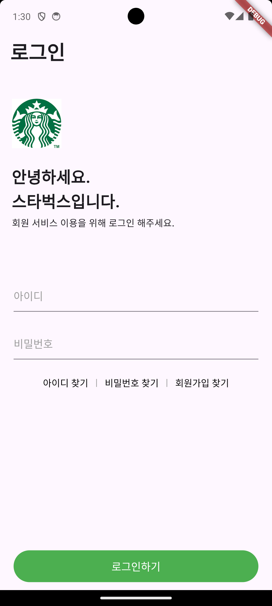

## 스타벅스 로그인 화면
* 백버튼은 제외

### 내맘대로 생각하는 UI 구조
* AppBar
  * 로그인 텍스트
* Column
  * Image - 스타벅스 로고
  * Text - 인삿말
  * 변경될 상태가 없으므로 Stateless Widget으로 구현
* Column
  * TextField - 아이디 입력
  * TextField - 비밀번호 입력
  * Row 
    * Button - 아이디 찾기
    * Button - 비밀번호 찾기
    * Button - 회원가입
* Stack
  * Container - 상단 쉐도우
    * Button - 로그인하기

### 알게된 것들
* 로컬에 있는 이미지를 가져오기 위해서는 pubspec에서 asset을 활성화해야하고, 경로를 통해 이미지를 가져와야한다.
    ```dart
    // 1. images 폴더 생성
    // 2. asset에 사용하고자하는 이미지 경로 추가
    assets:
        - images/starbucks/starbucks_logo.png
    // 3. 사용시 경로를 String으로 넘겨서 사용
    Image.asset('images/starbucks/starbucks_logo.png');
    ```
* Flutter의 Column에는 Spacing이 없다. Wrap을 활용하면 정적인 값의 Spacing을 줄 수 있다.
  ```dart
  Wrap(
        direction: Axis.vertical,
        spacing: 10,
        children: [ 
            // ...
        ]
  );
  ```

* TextField는 Width값이 없을 경우, "RenderBox was not laid out"라는 오류를 발생 시킨다. 따라서 SizedBox, Expanded, Flexible등으로 감싸주고, Width를 줘야한다.
  ```dart
    SizedBox(
        width: MediaQuery.sizeOf(context).width * 0.9,
        child: const TextField(
            style: TextStyle(
                color: Colors.black,
                fontSize: 16,
            ),
            // placeholder라는 프로퍼티 대신 InputDecoration 이라는 스타일 위젯이 존재한다.
            // 
            decoration: InputDecoration(
                hintText: '아이디',
                hintStyle: TextStyle(
                color: Colors.grey,
                ),
            ),
        ),
    ),
  ```

* 버튼 클릭시 발생하는 애니메이션 효과를 제거하는 방법
  ```dart
    // 만약 앱 전체에서 적용하려면 MaterialApp의 ThemeData에 추가해야하고, 개별적으로 사용하려면 Button의 style에 해당 코드를 추가하면 된다.
    ButtonStyle(
        overlayColor:
            WidgetStateColor.resolveWith((states) => Colors.transparent),
    ),
  ```

* 디바이스의 width를 가져오는 방법
    ```dart
    MediaQuery.sizeOf(context).width * 0.9
    ```
  
### 구현 화면
